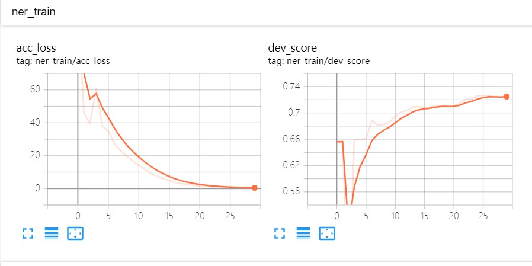
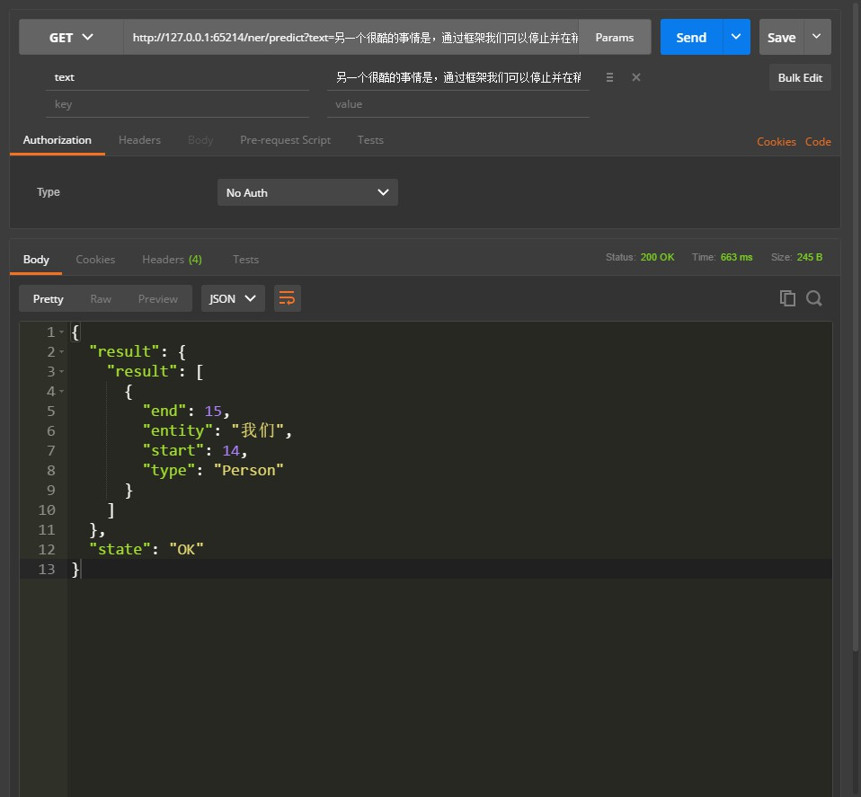
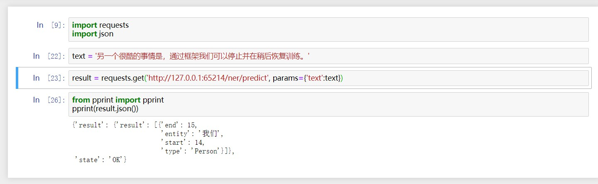

# lightNLP, 很基础的自然语言处理框架

## 简介

本项目基于Pytorch和torchtext，旨在提供一个基础的自然语言处理相关任务实现的深度学习框架。

有关详细说明和教程请参阅项目文档：[lightnlp-cookbook](https://lightnlp-cookbook.readthedocs.io/zh_CN/latest/index.html)

## 声明

1. 本项目从定位上来说只是一次收集和尝试，目的并不作为企业级和生产级使用，目标群体主要是对自然语言处理各任务实践感兴趣的其他方向计算机开发人员以及初学者，更主要的是**自娱自乐**。
2. 若有真正场景需求的用户或开发人员们可以参考[Industry 中文NLP商业服务](https://github.com/crownpku/Awesome-Chinese-NLP#industry-%E4%B8%AD%E6%96%87nlp%E5%95%86%E4%B8%9A%E6%9C%8D%E5%8A%A1)寻求商业服务，当然本渣也乐意提供有偿服务。
3. 对Pytorch和自然语言处理有一定了解的童鞋们，如果想追求快速开发且自由定制nlp应用，可以考虑复旦大学nlp实验室开源的[fastNLP](https://github.com/fastnlp/fastNLP)，框架功能丰富，且简洁易用。
3. 本项目并未像其他一些框架一样为各任务提供了一些训练数据和训练好的模型从而可以直接下载使用。
4. 本项目的诸多模型许多都是参考Github上原有实现，然后在基础之上二次加工而成，在这里要向相关作者致以诚挚的谢意！
5. 未对各任务模型的各种参数进行精细微调，仅仅只是能跑通的程度。
6. 本项目仅在以下本人两种开发环境下能跑通，其他环境出现的各种问题本人概不负责。
   - Windows 10， Python 3.6，Pytorch 1.3
   - Manjaro， Python 3.7，Pytorch 1.3

## 安装

```bash
pip install lightNLP
```

建议使用国内源来安装，如使用以下命令：
```bash
pip install -i https://pypi.douban.com/simple/ lightNLP
```

### 安装依赖

由于有些库如pytorch、torchtext并不在pypi源中或者里面只有比较老旧的版本，我们需要单独安装一些库。
#### 安装pytorch

请使用最新版本的Pytorch！

具体安装参见[pytorch官网](https://pytorch.org/get-started/locally/)来根据平台、安装方式、Python版本、CUDA版本来选择适合自己的版本。

#### 安装torchtext

使用以下命令安装最新版本torchtext：
```bash
pip install https://github.com/pytorch/text/archive/master.zip
```

## 示例

### 命名实体识别（ner）
#### 1.训练数据

BIO

训练数据示例如下：

```
清 B_Time
明 I_Time
是 O
人 B_Person
们 I_Person
祭 O
扫 O
先 B_Person
人 I_Person
， O
怀 O
念 O
追 O
思 O
的 O
日 B_Time
子 I_Time
。 O

正 O
如 O
宋 B_Time
代 I_Time
诗 B_Person
人 I_Person
```

#### 2.使用示例
##### 1.训练

```
from lightnlp.sl import NER

# 创建NER对象
ner_model = NER()

train_path = '/home/lightsmile/NLP/corpus/ner/train.sample.txt'
dev_path = '/home/lightsmile/NLP/corpus/ner/test.sample.txt'
vec_path = '/home/lightsmile/NLP/embedding/char/token_vec_300.bin'

# 只需指定训练数据路径和TensorBoard日志文件路径，预训练字向量可选，开发集路径可选，模型保存路径可选（模型保存路径默认为`xx_saves`，其中xx为模型简称，如ner）。
ner_model.train(train_path, vectors_path=vec_path, dev_path=dev_path, save_path='./ner_saves', log_dir='E:/Test/tensorboard/')
```

##### 2.测试

```
# 加载模型，默认当前目录下的`ner_saves`目录
ner_model.load('./ner_saves')
# 对train_path下的测试集进行读取测试
ner_model.test(train_path)
```

##### 3.预测

```
from pprint import pprint

pprint(ner_model.predict('另一个很酷的事情是，通过框架我们可以停止并在稍后恢复训练。'))
```

预测结果：

```
[{'end': 15, 'entity': '我们', 'start': 14, 'type': 'Person'}]
```

##### 4.查看训练效果

命令行中执行以下命令，其中`E:\Test\tensorBoard`修改为模型训练时日志存储路径，port端口指定可选：
```bash
tensorboard --logdir=E:\Test\tensorBoard --port=2019
```

可以看到类似如下效果：



### 5.部署服务

```python
ner_model.deploy(host="localhost", port=2020, debug=False)
```
其中所有参数都可选，`host`参数默认为`localhost`，`port`端口将由程序自动向系统申请空闲端口，默认不开启`debug`模式。

可以使用Postman或者编写程序进行调用测试，如下图：



## todo

### 业务

- [x] 增加项目简要说明文档
- [x] 提供各任务Demo训练数据

### 工程

- [x] 重构项目结构，将相同冗余的地方合并起来，保持项目结构清晰
- [x] 增加TensorBoard可视化功能，主要包含如loss和score的`scalar`和以及各model的`graph`（目前Pytorch中的SummaryWriter的add_graph功能有一些bug，所以暂时添加不了了。）。
- [x] 增加简易的基于flask的模型部署功能（当前仅用于模型的训练效果测试）
- [x] 现在模型保存的路径和名字默认一致，会冲突，接下来每个模型都有自己的`name`。
- [ ] 增加断点重训功能。
- [ ] 增加earlyStopping。

### 功能

- [x] 增加CBOW词向量相关模型以及训练预测代码
- [x] 增加skip_gram相关模型以及训练预测代码
- [x] 增加情感分析相关模型以及训练预测代码
- [x] 增加文本蕴含相关模型以及训练预测代码
- [x] 增加文本生成相关模型以及训练预测代码
- [x] 增加语言模型相关模型以及训练预测代码
- [x] 增加依存分析相关模型以及训练预测代码
- [x] 增加关系抽取相关模型以及训练预测代码
- [x] 增加中文分词相关模型以及训练预测代码
- [x] 增加词性标注相关模型以及训练预测代码
- [x] 增加事件抽取相关模型以及训练预测代码
- [x] 增加自动摘要相关模型以及训练预测代码 
- [x] 增加机器翻译相关模型以及训练预测代码 
- [x] 增加句子相似度相关模型以及训练预测代码
- [x] 增加序列到序列相关模型以及训练预测代码
- [x] 增加聊天机器人相关模型以及训练预测代码
- [x] 增加命名实体识别相关模型以及预测训练代码
- [ ] 增加一些任务的transformer实现（基于Pytorch官方实现的Transformer）
- [ ] 增加Elmo相关模型以及训练预测代码
- [ ] 增加GloVe相关模型以及训练预测代码
- [ ] 增加GPT相关模型以及训练预测代码
- [ ] 增加Bert相关模型以及训练预测代码
- [ ] 增加属性抽取相关模型以及训练预测代码
- [ ] 增加指代消解相关模型以及训练预测代码
- [ ] 增加词义消歧相关模型以及训练预测代码
- [ ] 增加阅读理解相关模型以及训练预测代码
- [ ] 增加关键词抽取相关模型以及训练预测代码
- [ ] 增加成分句法分析相关模型以及预测训练代码

## 打赏

如果该项目对您有所帮助，欢迎打赏~

